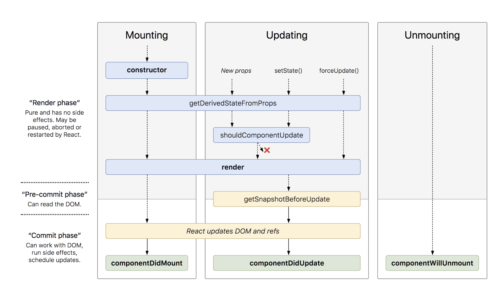

### Q. What are the different phases of React component’s lifecycle?

There are three different phases of React component’s lifecycle:

#### 1. Initial Rendering Phase:
This is the phase when the component is about to start its life journey and make its way to the DOM.
#### 2. Updating Phase: 
Once the component gets added to the DOM, it can potentially update and re-render only when a prop or state change occurs. That happens only in this phase.
#### 3. Unmounting Phase: 
This is the final phase of a component’s life cycle in which the component is destroyed and removed from the DOM.

### Q. Explain the lifecycle methods of React components in detail?

Old Component life cycle methods

#### Initial Rendering Phase (Mount Phase)

1. constructor
2. componentWillMount
3. render
4. componentDidMount

#### Updating Phase
5. componentWillRecieveProps
6. shouldComponentUpdate
7. componentWillUpdate
8. render
9. componentDidUpdate

#### Unmounting Phase
10. componentWillUnmount

#### Depreceated methods in v16.4.0

1. componentWillMount => getDrivedStateFromPropss
2. componentWillReceiveProps => getDrivedStateFromProps
3. componentWillUpdate => getSnapshotBeforeUpdate

#### New Component life cycle methods

##### Initial Rendering Phase (Mount Phase)

1. constructor
2. static getDrivedStateFromProps    static getDerivedStateFromProps(nextProps, prevState) {}
3. render
4. componentDidMount

##### re rendering Phase (Updating Phase)
5. static getDrivedStateFromProps
6. shouldComponentUpdate        shouldComponentUpdate(nextProps, nextState){}
7. render
8. getSnapshotBeforeUpdate      getSnapshotBeforeUpdate(prevProps, prevState){}
9. componentDidUpdate

#####  Unmounting Phase
10. componentWillUnmount

### static getDrivedStateFromProps()

This method is replacement of componentWillRecieveProps which is going to deprecated soon. it is run right after constructor. It has role in inital render as well as in rerender.

### Q. Why getDrivedStateFromProps method is static?

Ans. Because we don’t want user to use this keyword inside it. Since static method are class method not instance method we don’t need this keyword to access this method. As the name suggest this method return new state based on props action. So it will protect you from doing all kind of mistake like this.setState inside this method.

### Life cycle methods of react hooks
#### useEffect 
useEffect is replacement of (componentDidMount, componentDidUpdate, componentWillUnmount)

#### useMemo
useEffect is replacement of (shouldComponentUpdate)

